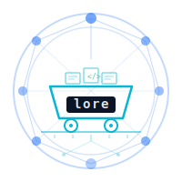
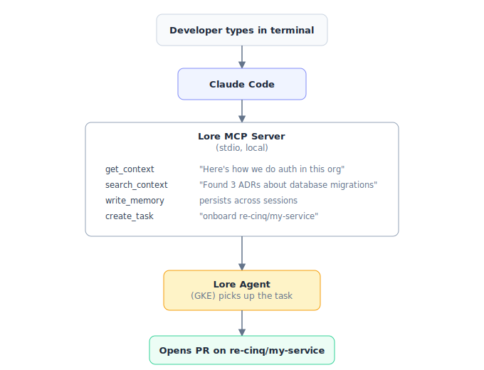
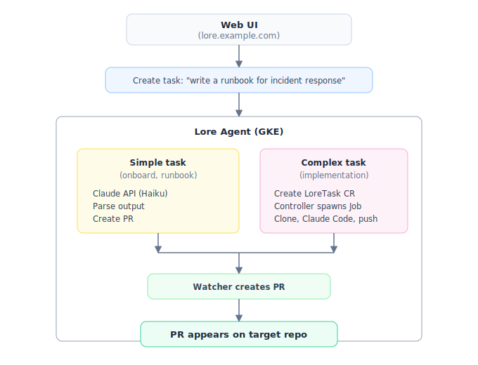
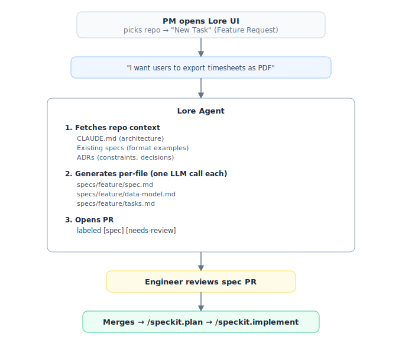
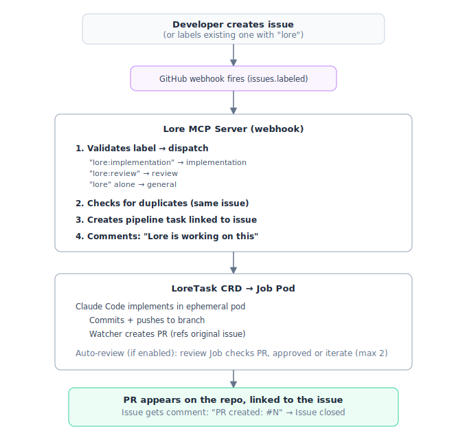
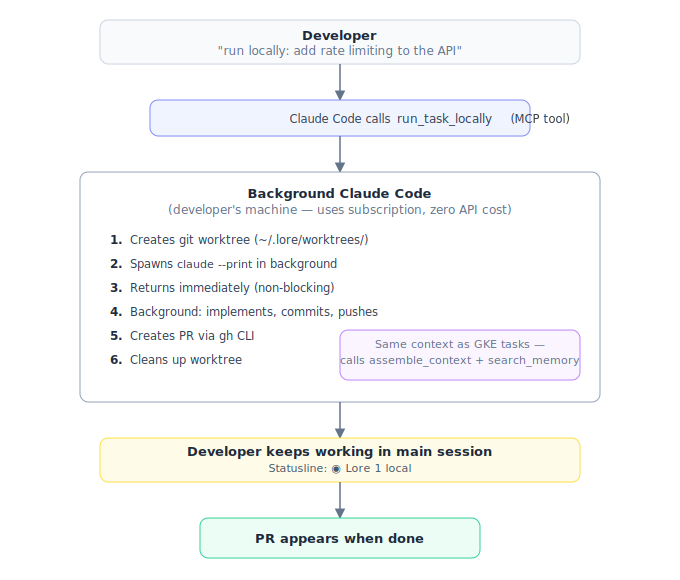
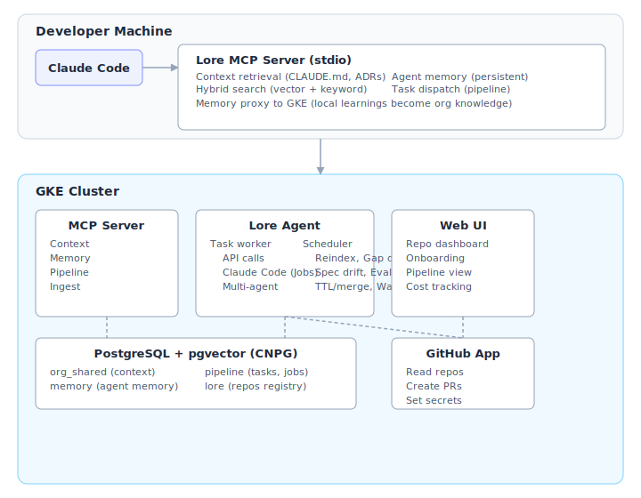

<p align="center">
  
</p>

<h1 align="center">Lore</h1>

<p align="center">
  Shared context infrastructure for Claude Code.<br/>
  Org awareness + agent memory + task pipeline in one platform.
</p>

<p align="center">
  
  
  
  
</p>

---

## What is Lore?

Lore is the shared context layer that makes Claude Code organization-aware. Developers open Claude Code and it already knows: org-wide conventions, team-specific patterns, architectural decisions, and current task state — without any manual context loading.

Beyond context, Lore is an **agent operating system**. It runs background agents that onboard repos, detect documentation gaps, check for spec drift, and review PRs — all producing pull requests that humans review and merge.

## Five Ways to Use Lore

### Flow 1: Developer with Claude Code (local)

A developer works in their repo. Claude Code connects to the Lore MCP server (stdio, proxied to GKE) and gets org context automatically. The developer can also create tasks that the agent picks up.

<p align="center"></p>

### Flow 2: Tasks via Web UI or API

A product owner or platform engineer creates a task through the dashboard. The Lore Agent processes it — either via direct API call (simple tasks) or by delegating to ephemeral Job pods via the LoreTask CRD (complex tasks).

<p align="center"></p>

### Flow 3: Product Manager → Spec (intent to implementation)

A PM describes what they want in plain language. Lore translates it into engineering artifacts following the repo's conventions.

<p align="center"></p>

### Flow 4: GitHub Issue → Agent (label dispatch)

A developer creates a GitHub Issue using the Lore issue template — or adds a `lore` label to any existing issue. Lore picks it up, implements it, and opens a PR linked to the original issue. No UI, no CLI, no context switch.

<p align="center"></p>

Issue templates are added during onboarding — developers see "Lore: Implementation", "Lore: Review", and "Lore: General Task" when creating new issues.

### Flow 5: Local Task Runner (background, zero API cost)

A developer says "run locally" and Claude Code spawns a background process in an isolated git worktree on the developer's machine. Uses the Claude Code subscription — no API credits consumed. The developer's session continues uninterrupted.

<p align="center"></p>

Same context flow as GKE tasks — the background process has its own MCP server instance, calls `assemble_context` and `search_memory` before coding.

### Agent Execution Modes

| Mode | When | How |
|------|------|-----|
| **API call** | Onboarding, runbooks, gap-fill, review, review-reactor fixes | Direct `@anthropic-ai/sdk` call to Claude Haiku. Fast, cheap ($0.01-0.07/task). Plain text in, plain text out. |
| **Claude Code (ephemeral Job)** | Implementation, refactoring, complex analysis | Creates a LoreTask CR → controller spawns an ephemeral K8s Job pod with claude-runner image. Full tool access, isolated resources, survives agent deploys. |
| **Multi-agent** | Large implementation tasks | Multiple LoreTask Jobs run in parallel. Each works on a different part of the task (e.g., one agent per file or module). Results merged into a single PR. |
| **Feature request** | PM intent | Fetches repo context, generates spec/data-model/tasks as individual files. Each artifact gets its own focused LLM call. |
| **Local runner** | Developer says "run locally" | Background `claude --print` in an isolated git worktree on the developer's machine. Uses Claude Code subscription — zero API cost. Non-blocking, PR created via `gh`. |

The agent service decides which mode to use based on the task type configured in `task-types.yaml`.

## Architecture

<p align="center"></p>

### Key Components

| Component | What it does |
|-----------|-------------|
| **MCP Server** | Serves org context to Claude Code via MCP protocol. Hybrid search (vector + BM25). Agent memory. Task CRUD. Push-triggered ingest API. |
| **Lore Agent** | Processes pipeline tasks. Calls Claude API for simple tasks, delegates complex tasks (implementation) to ephemeral Job pods via LoreTask CRD. Runs 10 scheduled maintenance jobs. Creates PRs via GitHub App. Every task automatically creates a GitHub Issue on the target repo, so developers see what Lore is doing without checking the dashboard. Issues are updated with status changes and closed when the PR is created. |
| **LoreTask Controller** | Watches LoreTask custom resources and spawns ephemeral K8s Job pods with the claude-runner image. Each Job pod clones the target repo, runs Claude Code, commits, and pushes. Tasks survive agent deploys and run in parallel with full isolation. |
| **Web UI** | Next.js dashboard with GitHub OAuth. Repo-centric view. One-click onboarding. Pipeline monitoring with cost tracking. Analytics dashboard. Global settings. |
| **PostgreSQL** | CloudNativePG with pgvector. Schema-per-team isolation. HNSW indexes for vector, GIN for keyword. |
| **GitHub App** | Reads repo content for onboarding. Creates branches, commits, and PRs. Sets Actions secrets for ingest automation. |

### Search

Hybrid search combines vector similarity (Vertex AI `text-embedding-005`, 768 dimensions) with BM25 keyword matching via Reciprocal Rank Fusion (k=60). Degrades gracefully to keyword-only when embeddings are unavailable.

### Agent Memory

15 MCP tools for persistent memory across sessions and restarts. Every memory is versioned, timestamped, and semantically searchable. When running locally, all memory operations are proxied to the GKE MCP server so learnings are shared org-wide.

Key capabilities:
- **Temporal fact invalidation** — facts have validity windows; contradictory facts are automatically invalidated via embedding similarity (threshold 0.92)
- **Passive episode ingestion** — `write_episode` accepts raw text (conversations, reviews, observations); facts and knowledge graph entities are extracted automatically. PR review feedback is auto-captured by the review-reactor job. Session summaries are captured via a Stop hook.
- **Live knowledge graph** — entities (services, teams, technologies) and relationships tracked in PostgreSQL, updated incrementally on every episode. Query with `query_graph`.
- **Graph-augmented search** — `search_memory(graph_augment=true)` enriches results with 1-hop knowledge graph neighbors of detected entities
- **Context assembly** — `assemble_context` retrieves from all sources and formats into a token-budgeted block using configurable YAML templates (default, review, implementation, research)
- **Retrieval benchmarks** — p50/p95/p99 latency tracked per tool in the audit log, visible in the analytics dashboard

### Repo Onboarding

One-click onboarding inspects the target repo, checks what files already exist, and generates only what's missing:

| File | Purpose |
|------|---------|
| `AGENTS.md` | Context loading order, workflow commands, conventions for AI agents |
| `adrs/ADR-*.md` | Architectural decisions inferred from the codebase |
| `.specify/spec.md` | System specification describing what the repo does today |
| `.github/PULL_REQUEST_TEMPLATE.md` | Structured PR template (Why, Alternatives, ADRs) |
| `.github/workflows/pr-description-check.yml` | CI enforcing PR description quality |
| `.github/workflows/lore-ingest.yml` | Push-triggered context ingestion |

After the PR is merged, the agent automatically configures ingest secrets so context stays fresh on every push.

### Scheduled Jobs

| Job | Schedule | What it does |
|-----|----------|-------------|
| Context reindex | Daily 2 AM | Re-embed changed content for all repos |
| Gap detection | Monday 9 AM | Find missing documentation, create gap-fill tasks |
| Spec drift | Monday 10 AM | Compare specs against actual code |
| Merge check | Every 60s | Detect merged onboarding PRs, trigger ingestion |
| Review reactor | Every 5 min | Detect human review feedback on agent PRs, generate fixes, commit to branch |
| Approval check | Every 60s | Check for approved label on tasks awaiting approval |
| Memory TTL | Every hour | Clean up expired memory entries |
| Eval runner | Daily 3 AM | Run PromptFoo evals for all teams, detect quality regressions |
| Context core builder | Daily 4 AM | Compare context quality to baseline, promote improvements |
| LoreTask watcher | Every 60s | Poll completed LoreTasks: create PRs, trigger auto-review, handle review results, clean up |
| Autoresearch | Monday 6 AM | Find low-confidence queries from Langfuse, generate context candidates, open PRs |

## Getting Started

```bash
git clone git@github.com:re-cinq/lore.git
cd lore && scripts/install.sh
```

This configures the MCP server, skills, hooks, statusline, and agent ID. The MCP server runs locally via stdio but proxies all operations to the GKE backend — the backend must be deployed first. See [`docs/INSTALL.md`](docs/INSTALL.md) for the complete deployment guide.

## Project Structure

```
lore/
├── mcp-server/          # MCP server (TypeScript, serves context + memory + pipeline)
├── agent/               # Lore Agent service (TypeScript, task runner + scheduler)
├── web-ui/              # Next.js dashboard (repo-centric UI, GitHub OAuth)
├── scripts/             # install.sh, lore-doctor, infra setup scripts
├── docker/claude-runner/ # Ephemeral container for Claude Code in K8s Jobs
├── terraform/modules/   # Helm charts (mcp-helm, agent-helm), LoreTask CRD
├── k8s/                 # Ingress manifests, CronJobs
├── adrs/                # Architecture decision records (MADR format)
├── specs/               # Feature specifications (speckit workflow)
├── teams/               # Per-team CLAUDE.md overrides
└── .github/workflows/   # CI: build + push containers for MCP, agent, UI
```

## Design Principles

1. **DX-first** — developer experience validated before infrastructure investment
2. **Zero stored credentials** — Workload Identity everywhere, no secrets in code
3. **Single interface** — developers talk to the Lore MCP server, never directly to agents or databases
4. **Intelligent agents over scripts** — agents that understand code, not scripts that chunk text
5. **Schema-per-team isolation** — SQL-level access control without a separate auth layer

Architecture decisions are documented as ADRs in `adrs/`.

## Tech Stack

| Layer | Technology |
|-------|-----------|
| MCP Server | TypeScript, `@modelcontextprotocol/sdk`, Zod |
| Agent | TypeScript, `@anthropic-ai/sdk`, Claude Code (headless) |
| Web UI | Next.js 15, NextAuth v4 (GitHub OAuth) |
| Database | PostgreSQL 16 + pgvector (CloudNativePG) |
| Embeddings | Vertex AI `text-embedding-005` (768 dim) |
| Search | Hybrid: HNSW vector + BM25 keyword, RRF fusion. AST-based code chunking via tree-sitter |
| Code parsing | web-tree-sitter (TypeScript, Python, Go) |
| GitHub | Octokit + `@octokit/auth-app` (GitHub App) |
| Observability | OpenTelemetry traces + metrics |
| Infrastructure | GKE, Helm, cert-manager, external-dns |

## How To

### For Developers: Get org context in Claude Code

After running `install.sh`, Claude Code automatically loads org context for whatever repo you're in. The MCP server runs locally via stdio and proxies all operations to the GKE backend.

Every session follows an enforced workflow:

1. **`assemble_context`** runs first — loads conventions, ADRs, memories, facts, and graph in one call
2. **`search_memory`** runs before planning or building — checks if the problem was already solved, with multiple search queries
3. **During work** — `search_context`, `query_graph`, `create_pipeline_task` as needed
4. **Session end** — `write_memory` with session summary, `write_episode` for passive fact extraction

This prevents agents from re-debugging problems that were already solved and ensures org knowledge is always consulted.

```bash
# Context + memory loaded automatically — Claude just knows
claude "how do we handle auth in this repo?"
# → assemble_context pulls CLAUDE.md, ADRs, team patterns, relevant memories

claude "what was the decision on database migrations?"
# → Returns relevant ADRs with rationale and alternatives rejected

# Persistent memory across sessions — shared org-wide
claude "remember that we decided to use UUIDs for all new tables"
# → Stored via write_memory, searchable next session via search_memory
# → Every developer in the org finds this via search_memory

# Knowledge graph — entity relationships
claude "what uses PostgreSQL in our infrastructure?"
# → query_graph returns: auth-service, lore-agent, etc.

# Delegate work to the agent pipeline (proxied to GKE)
claude "create a runbook for database failover in re-cinq/my-service"
# → Calls create_pipeline_task → proxied to GKE → agent picks it up → PR created

# Check task status
claude "what's the status of my last pipeline task?"
# → Returns status, PR link, cost, duration
```

The MCP server runs locally via stdio and proxies all operations (context, memory, search, pipeline) to the GKE backend via `LORE_API_URL`. There is no offline mode — the backend must be running. The install script configures the API URL automatically.

**All MCP tools available to Claude Code:**

| Tool | Category | What it does |
|------|----------|-------------|
| `get_context` | Context | Merged CLAUDE.md for current repo (auto-detected from git remote) |
| `get_adrs` | Context | ADRs filtered by domain and status |
| `search_context` | Context | Hybrid search (vector + keyword) across all org context |
| `write_memory` | Memory | Store a persistent memory with optional TTL and fact extraction |
| `read_memory` | Memory | Retrieve by key, supports version history |
| `search_memory` | Memory | Semantic search across memories and facts. Supports `include_invalidated` for history, `graph_augment` for 1-hop graph enrichment |
| `list_memories` | Memory | Paginated listing of active memories |
| `delete_memory` | Memory | Soft-delete (preserved in history) |
| `write_episode` | Memory | Ingest raw text; auto-extracts facts and updates knowledge graph |
| `list_episodes` | Memory | List recent episodes with extracted fact counts |
| `query_graph` | Memory | Query live knowledge graph for entities and relationships |
| `assemble_context` | Memory | Retrieve + assemble context from all sources into a structured, token-budgeted block |
| `shared_write` / `shared_read` | Memory | Cross-agent shared memory pools |
| `create_snapshot` / `restore_snapshot` | Memory | Point-in-time backup and restore |
| `agent_health` / `agent_stats` | Memory | Usage stats, active/invalidated facts, daily breakdown |
| `create_pipeline_task` | Pipeline | Create task on GKE (API cost) |
| `run_task_locally` | Pipeline | Run task in background on dev machine (subscription, zero API cost) |
| `list_local_tasks` | Pipeline | Show running/completed local background tasks |
| `cancel_local_task` | Pipeline | Cancel a local background task |
| `get_pipeline_status` | Pipeline | Task status and event timeline |
| `list_pipeline_tasks` | Pipeline | List tasks with status filter |
| `cancel_task` | Pipeline | Cancel a running or pending task |
| `sync_tasks` | Tasks | Parse tasks.md and sync to pipeline database |
| `ready_tasks` | Tasks | List unblocked tasks (all dependencies satisfied) |
| `claim_task` | Tasks | Atomically claim a task to prevent double work |
| `complete_task` | Tasks | Mark done, report newly unblocked dependents |
| `list_repos` | Repos | All onboarded repos with activity stats |
| `onboard_repo` | Repos | Onboard a new repo to Lore |
| `ingest_files` | Ingest | Manually ingest files into Lore's context store |

### GitHub Issue Dispatch

Add a `lore` label to any GitHub Issue on an onboarded repo and Lore
automatically creates a pipeline task from it. No context switch needed —
developers stay in their GitHub workflow.

- `lore` label → general task
- `lore:implementation` → implementation task (ephemeral Job)
- `lore:review` → review task
- `lore:runbook` → runbook task

Duplicate prevention: if an active task already exists for the issue,
Lore comments with the existing task ID instead of creating a new one.

Requires a webhook on the repo: `POST https://LORE_API_DOMAIN/api/webhook/github`
with events `Issues` and HMAC secret from `LORE_WEBHOOK_SECRET`.

### GitHub Issue Notifications

Every pipeline task creates an issue on the target repo labeled `lore-managed`. You'll see it in your GitHub notifications when:
- A task starts on your repo (issue opened)
- The agent creates a PR (comment with PR link, issue closed)
- A task fails (issue stays open with `lore-failed` label)

Filter with `label:lore-managed` to see all Lore activity on any repo.

### For Platform Engineers: Onboard a repo

**Via UI:**
1. Go to `LORE_UI_DOMAIN/onboard`
2. Enter `owner/repo` (e.g., `re-cinq/my-service`)
3. Click "Onboard Repository"
4. Agent inspects the repo, generates CLAUDE.md, ADRs, spec, CI workflows
5. PR appears on the target repo — review and merge
6. Ingest secrets are configured automatically

**Via CLI:**
```bash
claude "onboard re-cinq/my-service to lore"
```

For repos not yet onboarded, developers can still ingest specific files manually:
```bash
claude "ingest CLAUDE.md and the ADRs into Lore"
```

**What gets generated** (only files that don't already exist):
- `AGENTS.md` — context loading, commands, conventions for AI agents
- `adrs/ADR-001-*.md` — architectural decisions inferred from code
- `.specify/spec.md` — system spec describing what the repo does
- `.github/PULL_REQUEST_TEMPLATE.md` — structured PR template
- `.github/workflows/pr-description-check.yml` — CI for PR quality
- `.github/workflows/lore-ingest.yml` — push-triggered ingestion

### Feature Lifecycle: From Idea to Merged PR

This is how a feature goes from a product manager's idea to production code, step by step.

#### Step 1: PM describes the feature (Lore UI)

Open `LORE_UI_DOMAIN` → pick your repo → "New Task" → "Feature Request".

Describe what you want in plain language. No technical jargon needed:

> *"I want users to be able to export their approved timesheets as PDF,
> grouped by project, with the company logo. Should work for a single
> month or a custom date range."*

Click "Create Task". That's it for the PM.

#### Step 2: Agent generates the spec (automatic)

Within 10 minutes, the Lore Agent:
- Fetches the repo's context (CLAUDE.md, ADRs, existing specs, org memories)
- Generates `specs/export-timesheets-pdf/spec.md` — a proper engineering spec with problem statement, user scenarios, functional requirements, and success criteria
- Generates `specs/export-timesheets-pdf/data-model.md` — database changes needed
- Generates `specs/export-timesheets-pdf/tasks.md` — implementation checklist with file paths matching the actual project structure
- Opens a PR on the repo labeled `spec` + `needs-review`
- Creates a GitHub Issue linking everything together

The agent matches the repo's existing conventions automatically. The PM never needs to know speckit, MADR, or any engineering format.

#### Step 3: Engineer reviews the spec (GitHub)

The engineer sees the GitHub Issue notification. They:
- Open the spec PR
- Review the requirements — are the user scenarios right? Missing edge cases?
- Refine anything the agent got wrong
- Merge the PR

The spec files (`spec.md`, `data-model.md`, `tasks.md`) now live on `main`.

#### Step 4: Engineer implements with Claude Code

```bash
cd ~/projects/re-cinq/re-plan
claude
```

Then type:

```
/lore-feature
```

Claude will:
1. List available specs in `specs/` — engineer picks `export-timesheets-pdf`
2. Read the spec, data model, and task breakdown
3. Create a feature branch: `feat/export-timesheets-pdf`
4. Start working through tasks in order:
   - Show: *"Working on T001: Create PDF export service in worker/src/services/pdf-export.service.ts"*
   - Implement the code following the repo's conventions
   - Mark `- [x] T001` in tasks.md
   - Commit: `feat(time): add PDF export service`
5. Ask: *"T001 done. Continue to T002?"*
6. Repeat until all tasks are done or the engineer stops

#### Step 5: Engineer opens the PR

When implementation is done:

```
/lore-pr
```

Claude will:
1. Read the spec, diff against main, find related ADRs
2. Draft a complete PR description (Why, What Changed, Alternatives, Testing)
3. Show the draft for review
4. After confirmation: push the branch and create the PR via `gh pr create`

#### Step 6: Review and merge

The PR goes through normal code review. If the repo has `auto_review: true`
in settings, Lore automatically reviews the PR against the spec and
conventions — no human needed for the first pass. If changes are
requested, a fix task is created automatically (up to 2 iterations
before escalating to a human).

```
PM idea → agent spec PR → engineer review → engineer implements → PR → merge
```

The entire flow from "I want X" to merged code, with proper specs, tracked tasks, and structured PRs at every step.

### Monitoring

**Web UI** (`LORE_UI_DOMAIN`):
- Pipeline page shows all tasks with status, cost, PR links, and live PR state badges
- Task detail page shows live agent output in a terminal-style log viewer (polls every 5s while running)
- Repo view shows context, active tasks, and memory for each repo
- Search page queries across all onboarded repos

**Agent health** endpoint:
```bash
curl https://LORE_API_DOMAIN/healthz
# Returns: uptime, tasks processed, job schedules, DB status
```

**LLM costs** tracked per task in `pipeline.llm_calls` table — visible in the pipeline dashboard.

### Analytics

The analytics dashboard at `LORE_UI_DOMAIN/analytics` shows:
- Cost overview cards (today, 7-day, 30-day)
- Task summary by status
- Retrieval performance (p50/p95/p99 latency per MCP tool, 200ms threshold)
- Cost breakdown by task type and by repo
- Daily cost trend chart
- Scheduled job run history

Additional pages:
- `/episodes` — browse ingested episodes with source filter and fact counts
- `/graph` — explore knowledge graph entities, relationships, and temporal validity

Also available programmatically via the `get_analytics` MCP tool.

### Global Settings

Platform configuration at `LORE_UI_DOMAIN/settings`:
- **API URL** — the external MCP server endpoint
- **Ingest Token** — shared auth token for API calls
- **Regenerate Token** — rotates the token (invalidates all existing)
- **Dev Install Command** — copy-paste for new developer onboarding
- **Approval Gates** — require human approval before agents process tasks (per-repo or global)

## License

Apache License 2.0 — see [LICENSE](LICENSE).
